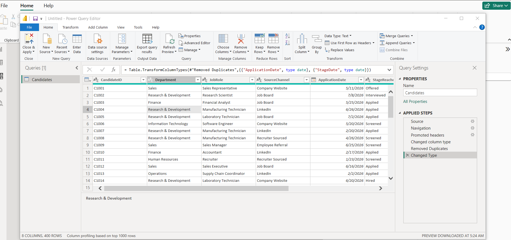
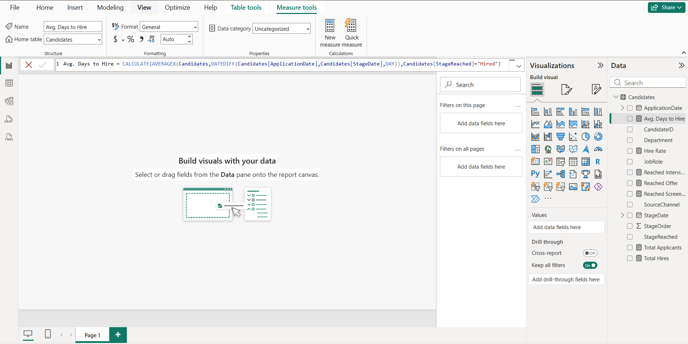
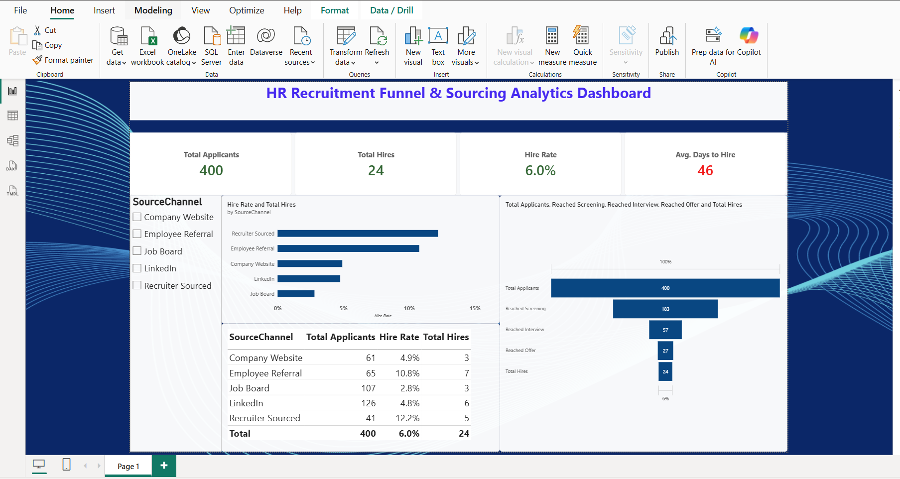

# HR Recruitment Funnel & Sourcing Analytics Dashboard

A Power BI dashboard analyzing where candidates drop out of the hiring funnel and which sourcing channels actually deliver reliable hires — not just high headline rates.

*(Built on a synthetic practice dataset modeling realistic recruiting patterns — not real company data.)*

## Business Question

Where should recruiting effort and budget be focused to fill roles faster and more effectively? Specifically:
- Where in the funnel are the biggest candidate drop-offs?
- Which sourcing channels produce hires, not just applicants?
- How long does it take to fill a role?

## Dataset

400 synthetic candidate records across 6 departments and 5 sourcing channels (LinkedIn, Employee Referral, Job Board, Company Website, Recruiter Sourced), tracking each candidate's furthest stage reached (Applied → Screened → Interviewed → Offered → Hired) and the relevant dates.

## Tools

Power BI · Power Query · DAX · Data Modeling

## Approach

- Cleaned and typed the raw data in Power Query
- Built cumulative DAX measures (`CALCULATE` with threshold filters) to drive a proper funnel shape
- Calculated Hire Rate and Average Days to Hire, including first-time use of `DATEDIFF` and `AVERAGEX` for date-based measures
- Designed the report around a KPI row, a funnel visual, and a source-channel comparison, with conditional formatting for at-a-glance signal

**Power Query — cleaning and typing the raw data:**

**DAX — the Average Days to Hire measure, using AVERAGEX and DATEDIFF:**

## Key Finding

Recruiter Sourced showed the highest headline hire rate (12.2%) — but that number was built on only 5 hires out of 41 applicants. Employee Referral, at a close 10.8%, was backed by 7 hires out of 65 applicants: a larger, more reliable sample that also produced more actual hires. **The headline rate pointed to one channel; the reliable number pointed to another** — the same small-sample caution that came up in the companion attrition project.

## Dashboard

## Repository Contents

- `HR_Recruitment_Funnel_Dataset.xlsx` — the source data
- `recruitment-funnel-dashboard.pbix` — the Power BI file 
- `power-query-cleaning.png` — Power Query cleaning steps
- `dax-funnel-measures.png` — the Average Days to Hire DAX measure
- `recruitment-dashboard-final.png` — the finished dashboard
- `README.md` — this file

## Skills Demonstrated

- Data cleaning and transformation (Power Query)
- Data modeling and DAX (CALCULATE, AVERAGEX, DATEDIFF, threshold-based counting)
- Dashboard design (KPI hierarchy, conditional formatting, tooltips)
- Statistical judgment — distinguishing a reliable pattern from small-sample noise before drawing a conclusion

